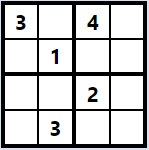

# SudokuSolverWeb-Backend
This is a sudoku solver app written in Java using Spring Boot. This app uses backtracking to solve a valid sudoku board of any size (4x4, 9x9, 16x16, etc). 

## How to use: 

### Interactive web app:
Input a puzzle at [sudoku-kg.herokuapp.com](sudoku-kg.herokuapp.com) and the solution will be displayed instantly.

### API:
Query the API directly with a post request to [sudoku-api-kg.herokuapp.com](sudoku-api-kg.herokuapp.com). Request body should send the puzzle as a 1-d integer array, filled out row by row, in the field name "original". Represent unknown squares as 0.  For example:
```
{
  "original": [
    3,
    0,
    4,
    0,
    0,
    1,
    0,
    0,
    0,
    0,
    2,
    0,
    0,
    3,
    0,
    0    
  ]
}
```
represents the 4x4 sudoku square: 

 

Response will include the original puzzle (field name "original"), solved puzzle if available (field name "solution"), and boolean stating whether the puzzle was solved (fieldname "solved"). If the puzzle was not solved, the "solution" field will contain the original puzzle. The response for the puzzle above is: 
```
{
    "solved": true,
    "original": [
        0,
        0,
        4,
        0,
        0,
        1,
        0,
        0,
        0,
        0,
        2,
        0,
        0,
        3,
        0,
        0
    ],
    "solution": [
        3,
        2,
        4,
        1,
        4,
        1,
        3,
        2,
        1,
        4,
        2,
        3,
        2,
        3,
        1,
        4
    ]
}
```

## Model: 
The sudoku board model is composed of multiple components and makes extensive use of polymorphism and inheritance.

### Square:
The smallest element of the model is an individual square, which holds a value and a boolean indicating whether it was provided in the original puzzle. The squares also keep track of which row, column, and box they are located in. A method is available to query the square's row, column, and box in order to determine possible values for the square.

### SquareGroup:
This is an abstract class representing any group of squares (row, column, box, or the entire board). The class implements methods to return the squares contained or return the values contained in the squares.

### Row, Column:
These classes extend the SquareGroup class and represent the rows and columns of the board, making it easy to query whether a row or column contains a value.

### Box: 
This class extends the SquareGroup class and represents a box of squares. In a typical 9x9 sudoku puzzle, this represents a 3x3 box of squares. Similar to the Row and Column classes, this class makes it easy to query whether a box contains a value. Additionally, the SudokuBoard class inherits this class due to similarity in structure, and this class is responsible for populating the rows in the SudokuBoard object.

### SudokuBoard:
This class extends the Box class and represents the entire sudoku board. The board contains the list of squares and a boolean of whether the board is solved.  Additionally, the board populates and retains  rows, columns, and boxes. 

### SudokuSummary:
This object is responsible for holding the API response containing the solution, if it exists. It also holds the original board and a boolean of whether the board is solved.

## Service: 
This package contains the solver and the service linking the API to the solver.

### SudokuSolver: 
This class implements the algorighm to solve the sudoku board in two steps: 

1. The solver looks for square values that do not require backtracking to solve, consisting of the following steps:
   - Iterate over all squares and determine if any squares have only one possible value.  If so, set the square to that value.
   - For a given square, determine if the current square is the only possible location for a given value in a respective row, column, or sub-box.

2. The rest of the board is solved by backtracking. The algorithm recursively steps through each square of the board and sets the square's value to the first integer that can be added without violating the rules (the same number can only appear in a row, column, and box once). If no values can be added, evaluation returns to the previous square and a new value is attempted. If evaulation passes the end of the board, the board is solved. Otherwise, no solution exists.

### SudokuService:
This class provides the interface between the API and the solver. The service receives the SudokuSummary object containing an array of the values of the board in order. From this input, the service creates the squares and board and then passes the board to the solver. Once the solver exits, the service sets the "solution" and "solved" fields in the SudokuSummary object and passes it back to the API.

## API: 

### SudokuController:
This class contains the API to call the solver. The API consists only of a post mapping which receives an integer array of the board values from the path variable (/sudoku/solve). The values are then passed to the service to create the board and solve the puzzle. 
