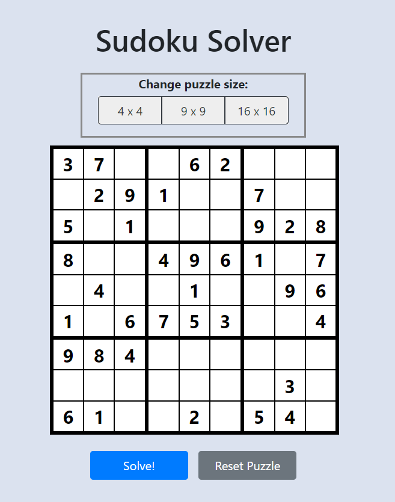
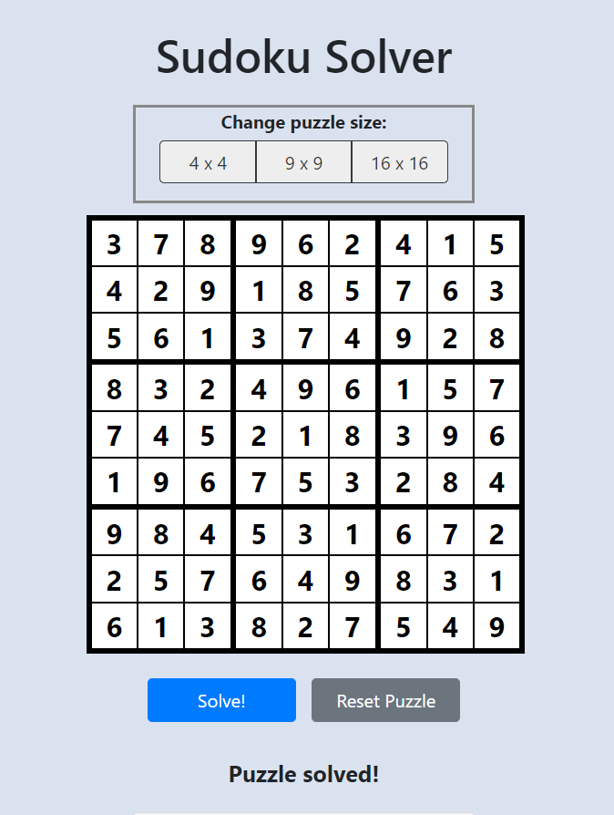
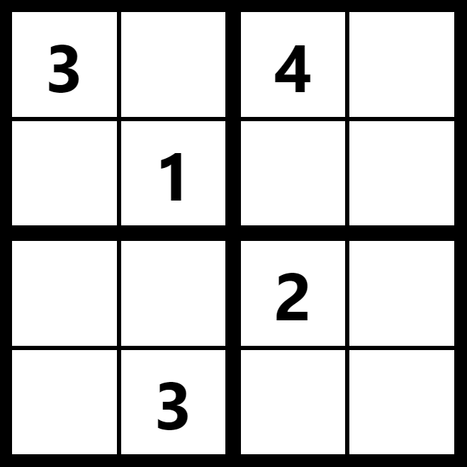

# Sudoku Solver 
This is a application that can solve a sudoku puzzle. The backend of this application is written in Java while the front end is written in JavaScript using React. 

This application can be viewed online at [http://sudoku-kg.herokuapp.com](http://sudoku-kg.herokuapp.com). Additionally, the API can be queried directly by sending a post request to [http://sudoku-api-kg.herokuapp.com](http://sudoku-api-kg.herokuapp.com). 

## Sample Screenshots: 

### Unsolved 9x9 Board: 


### Solved 9x9 Board:


# SudokuSolverWeb-Frontend
This is the front end of a sudoku solver web app written in Javascript using React. The page was styled using React Boostrap. 

## React Components:

### BoardArea:
The BoardArea component contains everything related to rendering and manipulating the sudoku board. State variables and callbacks are also defined in this section (see below).

#### BoardSizeSelector:
The BoardsizeSelectorcomponent returns a button group with three size options for the sudoku puzzle: 4x4, 9x9, and 16x16. Larger puzzles (such as 25x25) can be added by adding an additional button which returns the larger side length in the "value" field on click; however, the larger puzzles take exponentially longer to solve and are therefore impractical to support on the site.

#### LargeBoardDirections:
This component is displayed when a board larger than 9x9 is selected and instructs the user to represent numbers higher than 9 as letters. This is typical in "giant sudoku" online sites in order to keep each cell to 1 character.

#### SudokuBoard:
This component represents the sudoku board. The sudoku board is built up of smaller Square components which are arranged in a grid. The Squares are generated by mapping each value of the sudokuBoard state variable to a Square component. The grid is displayed using "gridTemplate" in the component style. The dimensions of the grid are defined through the props that are passed to the SudokuBoard component.

#### Square:
The Squares are the individual units of the SudokuBoard component. The square is an input field with a border. The each of the four borders are set such that when all squares are combined they create the expected sudoku board grid (thin lines separating squares in the same sub-box, thick lines separating sub-boxes). 

#### BottomButtons:
Below the board are two buttons: one to solve the puzzle and one to reset the board.

#### Solution: 
Below the buttons a message is printed stating whether the puzzle was solved or not. Before the "Solve" button is clicked, no message is displayed.

#### Directions:
This section gives directions to the user.

### Footer:
The footer contains links to the Github repositories for both the backend and frontend, as well as a copyright statement with a link to Kelly Gemmill's LinkedIn profile.

## State Variables and Callbacks:
All state variables and callback functions are defined in the BoardArea component. 

### State Variables:
The state variables include the board length, board size, sudoku board (defined as a 1-d character array of the same size as the board) and the message to display below the board (either "Puzzle solved" or "No solution found").

### Callbacks and Auxiliary Functions:

#### solvePuzzle(): 
This is the callback function for the "Solve!" button. The values in the puzzle are converted to integers and then sent to the solver API. Upon response, the sudokuBoard and solutionFound state variables are updated in accordance with the response from the API.

#### convertToInt(value):
This function converts a character from the sudoku board to an integer in order to send to the API, as the API requires an integer array. This also requires converting alphabetical characters to the required equivalent integer (A -> 10, B -> 11, etc.) and converting empty spaces to 0, as required by the API.

#### convertToChar(value):
This function converts the integers sent from the API back to a characters, including converting 0 to an empty space (if the board was not solved) and converting numbers greater than 9 to letters.

#### handleSudokuInput(event):
This function updates the sudoku board state variable to what is input by the user. The function ensures that each box only contains one value, which is bounde by the size of the board (e.g. if the user tries to input a 5 in a 4x4 board, nothing is displayed). Additionally, for large boards, lowercase character entries are converted to uppercase.

# SudokuSolverWeb-Backend
This is a sudoku solver API written in Java using Spring Boot. This app uses backtracking to solve a valid sudoku board of any size (4x4, 9x9, 16x16, etc). 

## How to use: 

### Interactive web app:
Input a puzzle at [http://sudoku-kg.herokuapp.com](http://sudoku-kg.herokuapp.com) and the solution will be displayed.

### API:
Query the API directly with a post request to [http://sudoku-api-kg.herokuapp.com](http://sudoku-api-kg.herokuapp.com). Request body should send the puzzle as a 1-d integer array, filled out row by row, in the field name "original". Input array must represent a perfect square (e.g. 4x4, 9x9, 16x16). Represent unknown squares as 0.  For example:
```
{
  "original": [3,0,4,0,0,1,0,0,0,0,2,0,0,3,0,0]
}
```
represents the 4x4 sudoku square: 

 

Response will include the original puzzle (field name "original"), solved puzzle if available (field name "solution"), and boolean stating whether the puzzle was solved (fieldname "solved"). If the puzzle was not solved, the "solution" field will contain the original puzzle. The response for the puzzle above is: 
```
{
  "solved":true,
  "original":[3,0,4,0,0,1,0,0,0,0,2,0,0,3,0,0],
  "solution":[3,2,4,1,4,1,3,2,1,4,2,3,2,3,1,4]
}
```
If an unsolvable sudoku board is posted to the API, the same will be returned with "solved" set to false. For instance, if the number 3 appears twice in the first sub-box of the puzzle above, the following is returned: 
```
{
  "solved":false,
  "original":[3,3,4,0,0,1,0,0,0,0,2,0,0,3,0,0],
  "solution":[3,3,4,0,0,1,0,0,0,0,2,0,0,3,0,0]
}
```

## Model: 
The sudoku board model is composed of multiple components and makes use of polymorphism and inheritance.

### Square:
The smallest element of the model is an individual square, which holds a value and a boolean indicating whether it was provided in the original puzzle. The squares also keep track of which row, column, and box they are located in. A method is available to query the square's row, column, and box in order to determine possible values for the square.

### SquareGroup:
This is an abstract class representing any group of squares (row, column, box, or the entire board). The class implements methods to return the squares contained or return the values contained in the squares.

### Row, Column:
These classes extend the SquareGroup class and represent the rows and columns of the board, making it easy to query whether a row or column contains a value.

### Box: 
This class extends the SquareGroup class and represents a box of squares. In a typical 9x9 sudoku puzzle, this represents a 3x3 box of squares. Similar to the Row and Column classes, this class makes it easy to query whether a box contains a value. Additionally, the SudokuBoard class inherits this class due to similarity in structure, and this class is responsible for populating the rows in the SudokuBoard object.

### SudokuBoard:
This class extends the Box class and represents the entire sudoku board. The board contains the list of squares and a boolean of whether the board is solved.  Additionally, the board populates and retains  rows, columns, and boxes. 

### SudokuSummary:
This object is responsible for holding the API response containing the solution, if it exists. It also holds the original board and a boolean of whether the board is solved.

## Service: 
This package contains the solver and the service linking the API to the solver.

### SudokuSolver: 
This class implements the algorighm to solve the sudoku board in two steps: 

1. The solver looks for square values that do not require backtracking to solve, consisting of the following steps:
   - Iterate over all squares and determine if any squares have only one possible value.  If so, set the square to that value.
   - For a given square, determine if the current square is the only possible location for a given value in a respective row, column, or sub-box.

2. The rest of the board is solved by backtracking. The algorithm recursively steps through each square of the board and sets the square's value to the first integer that can be added without violating the rules (the same number can only appear in a row, column, and box once). If no values can be added, evaluation returns to the previous square and a new value is attempted. If evaulation passes the end of the board, the board is solved. Otherwise, no solution exists.

### SudokuService:
This class provides the interface between the API and the solver. The service receives the SudokuSummary object containing an array of the values of the board in order. From this input, the service creates the squares and board and then passes the board to the solver. Once the solver exits, the service sets the "solution" and "solved" fields in the SudokuSummary object and passes it back to the API.

## API: 

### SudokuController:
This class contains the API to call the solver. The API consists only of a post mapping which receives an integer array of the board values from the path variable (/sudoku/solve). The values are then passed to the service to create the board and solve the puzzle. 


